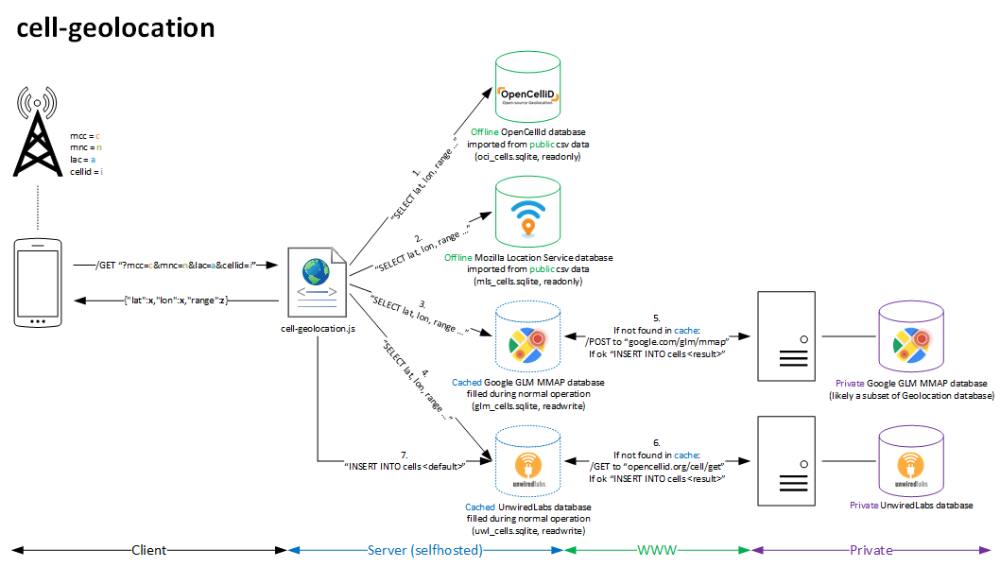

# Self hosted cell tower geolocation server

A self hosted cell tower geolocation server inspired by [Jan Jongboom](https://github.com/janjongboom/opencellid).

You'll want to use this if you want to have the most complete, free and self hosted cell tower geolocation server.

Underneath the hood, the following data sources are used in descending order:
1. [Mozilla Location Service: offline database](https://location.services.mozilla.com/downloads)
2. [OpenCellId: offline database](https://www.opencellid.org/downloads.php)
3. OpenCellId (effectively a fallback to UnwiredLabs): self created cache database
4. Own cache database with approximated and default locations
5. [OpenCellId (effectively a fallback to UnwiredLabs): online service](http://wiki.opencellid.org/wiki/API)
6. Approximated location according to midpoint of towers from OpenCellId offline database with same MCC, MNC and LAC (range: 2147483648)
7. Default location (lat: 46.909009, lon: 7.360584, range: 4294967295)

Remark: The OpenBmap / Radiocells.org offline database is not used, because it is considered tiny compared to the OpenCellId and Mozilla Location Service databases.

## Installation (database creation)

### SQLite extension-functions.c

    sudo apt-get install -y libsqlite3-dev
    wget -O extension-functions.c https://www.sqlite.org/contrib/download/extension-functions.c?get=25
    gcc -fPIC -lm -shared extension-functions.c -o libsqlitefunctions.so

### Mozilla Location Service database

    wget -O mls_cells.csv.gz "https://d2koia3g127518.cloudfront.net/export/MLS-full-cell-export-$(date -u "+%Y-%m-%d")T000000.csv.gz"
    cat mls_cells.csv.gz | gunzip - > mls_cells.csv
    cat schema.sql | sqlite3 mls_cells.sqlite
    cat mls_import.sql | sqlite3 mls_cells.sqlite

### OpenCellId database

    wget -O oci_cells.csv.gz "https://download.unwiredlabs.com/ocid/downloads?token=<YOUR_OPENCELLID_API_KEY>&file=cell_towers.csv.gz"
    cat oci_cells.csv.gz | gunzip - > oci_cells.csv
    cat schema.sql | sqlite3 oci_cells.sqlite
    cat oci_import.sql | sqlite3 oci_cells.sqlite
    cat oci_cells-cleanup.sql | sqlite3 oci_cells.sqlite

### OpenCellId (effectively a fallback to UnwiredLabs) cache database

    cat cache_schema.sql | sqlite3 uwl_cells.sqlite

### Approximated and default cache database

    cat cache_schema.sql | sqlite3 own_cells.sqlite

## Running

Start the server:

    npm install
    OPENCELLID_API_KEY=<YOURS> node cell-geolocation.js

Use environment variables PORT and IP for different port/host. F.e.:

    PORT=1337 OPENCELLID_API_KEY=<YOURS> node cell-geolocation.js

## Queries and Responses (as of May 2022)

Query exmaple:

    curl -s 'http://localhost:5265/?mcc=228&mnc=1&lac=1212&cellid=7344428'
    {"lat":46.9433974,"lon":7.4872803,"range":2085}

Query which can be answered by using the OpenCellId online service:

    curl -s 'http://localhost:5265/?mcc=228&mnc=1&lac=1212&cellid=1234567'
    {"lat":46.952348,"lon":7.443353,"range":60391}

Query which can now be answered by using the OpenCellId cache database:

    curl -s 'http://localhost:5265/?mcc=228&mnc=1&lac=1212&cellid=1234567'
    {"lat":46.952348,"lon":7.443353,"range":60391}

Query which can be answered by using the approximated location e.g. if OpenCellId is out of balance:

    curl -s 'http://localhost:5265/?mcc=228&mnc=1&lac=1212&cellid=9999999'
    {"lat":46.95183145922996,"lon":7.446361633864006,"range":2147483648}

Query which can now be answered by using the own cache database:

    curl -s 'http://localhost:5265/?mcc=228&mnc=1&lac=1212&cellid=9999999'
    {"lat":46.95183145922996,"lon":7.446361633864006,"range":2147483648}

Query with non-existing cell tower which can only be answered by using the default location:

    curl -s 'http://localhost:5265/?mcc=0&mnc=0&lac=0&cellid=0'
    curl -s 'http://localhost:5265/?mcc=3100&mnc=41&lac=42971&cellid=9906077'
    {"lat":46.909009,"lon":7.360584,"range":4294967295}

The output is always a JSON object that has lat, lon and range.

## Maintenance

Remove entries in OpenCellId cache database which are present in Mozilla Location Service database or OpenCellId database:

    node uwl_cells-cleanup.js
    echo "VACUUM;" | sqlite3 uwl_cells.sqlite

Remove approximated locations in the own cache database (useful when assuming that the corresponding cells are now known by higher priority sources):

    echo "DELETE FROM cells WHERE range=2147483648;" | sqlite3 own_cells.sqlite
    echo "VACUUM;" | sqlite3 own_cells.sqlite

Remove default locations in the own cache database (useful when assuming that the corresponding cells are now known by higher priority sources):

    echo "DELETE FROM cells WHERE range=4294967295;" | sqlite3 own_cells.sqlite
    echo "VACUUM;" | sqlite3 own_cells.sqlite

Remove duplicate entries in OpenCellId and own cache database:

    echo "DELETE FROM cells WHERE rowid NOT IN (SELECT min(rowid) FROM cells GROUP BY mcc, mnc, lac, cellid);" | sqlite3 uwl_cells.sqlite
    echo "VACUUM;" | sqlite3 uwl_cells.sqlite
    echo "DELETE FROM cells WHERE rowid NOT IN (SELECT min(rowid) FROM cells GROUP BY mcc, mnc, lac, cellid);" | sqlite3 own_cells.sqlite
    echo "VACUUM;" | sqlite3 own_cells.sqlite

Find duplicate entries in Google GLM MMAP and OpenCellId cache database:

    echo "SELECT mcc, mnc, lac, cellid, count(*) as cell FROM cells GROUP BY mcc, mnc, lac, cellid HAVING count(*)> 1;" | sqlite3 uwl_cells.sqlite
    echo "SELECT mcc, mnc, lac, cellid, count(*) as cell FROM cells GROUP BY mcc, mnc, lac, cellid HAVING count(*)> 1;" | sqlite3 own_cells.sqlite

## Resources

OpenCellId and Mozilla Location Service [CSV Cell Fields](https://mozilla.github.io/ichnaea/import_export.html) definition.

## License

Released under the [WTFPL version 2](http://sam.zoy.org/wtfpl/).
